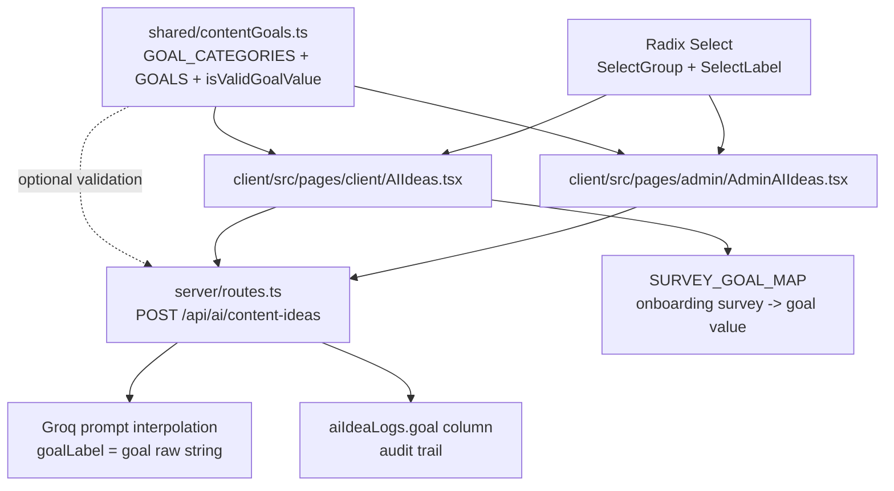
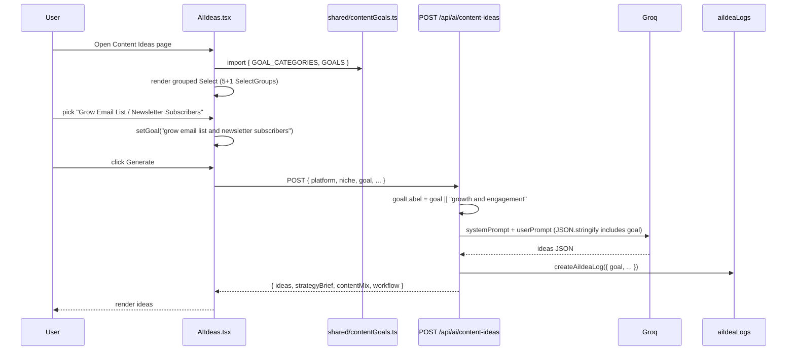
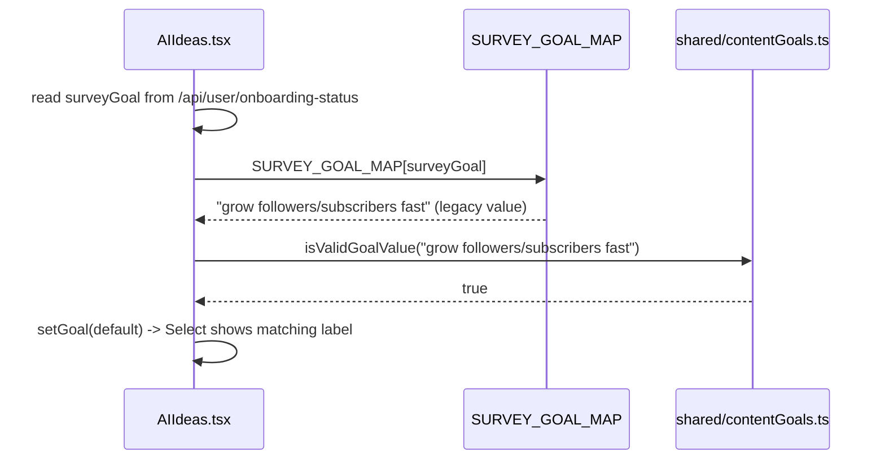

# Design Document: Instagram Content Ideas — Expanded Goals

## Overview

The Content Ideas feature (`/pages/client/AIIdeas.tsx` and `/pages/admin/AdminAIIdeas.tsx`) currently exposes 6 generic Goal options in a flat Radix/shadcn `<Select>`. This design expands the Goal selector to 32 options — the existing 6 (kept verbatim for backward-compatibility with `SURVEY_GOAL_MAP` and stored logs) plus 26 new Instagram-focused goals grouped under 5 category headers (Growth & Reach, Sales & Monetization, Brand & Community, Engagement & Retention, Content Strategy).

The goals live in one shared TypeScript module (`shared/contentGoals.ts`) so both the client page and the admin page read from a single source of truth. The module exports a typed, grouped structure (`GOAL_CATEGORIES`) plus a flat derivation (`GOALS`) that preserves the existing `{ value, label }[]` shape — no downstream consumer (survey mapping, backend prompt, `aiIdeaLogs` goal column) needs to change, and every old goal value remains valid.

The dropdown is rendered with Radix's native `SelectGroup` + `SelectLabel` primitives (already exported from `client/src/components/ui/select.tsx` but currently unused) so we pick up grouped semantics, keyboard navigation, and accessible labelling without adding a new dependency or custom component.

## Architecture



**Flow:**

1. `shared/contentGoals.ts` defines typed constants.
2. Both UI pages import `GOAL_CATEGORIES` for rendering grouped `<SelectGroup>` sections and `GOALS` for the survey-pre-fill default lookup.
3. User picks a goal; the `value` (prompt-friendly string) is POSTed to `/api/ai/content-ideas` as `goal`.
4. The server interpolates the raw `goal` string into the Groq system/user prompt (unchanged) and writes it to `aiIdeaLogs.goal`.
5. `SURVEY_GOAL_MAP` continues to resolve onboarding-survey answers to one of the six legacy values — all of which remain valid entries in the expanded list.

## Sequence Diagrams

### Goal selection → idea generation



### Survey default pre-fill (backward-compat)



## Components and Interfaces

### Component 1: `shared/contentGoals.ts` (new)

**Purpose**: Single source of truth for the goal taxonomy. Owns the category → goal tree, the flat derivation, and a runtime validator.

**Interface**:

```typescript
export interface GoalOption {
  /** Prompt-friendly string sent to backend and stored in aiIdeaLogs.goal. Lowercase, no special chars beyond '/', stable across releases. */
  value: string;
  /** Human label shown in the dropdown. */
  label: string;
  /** Optional one-liner shown as a muted subtitle under the label (e.g. "lead-magnet reels, comment-for-link hooks"). Not sent to backend. */
  hint?: string;
}

export interface GoalCategory {
  /** Stable slug used as React key and data-testid suffix. */
  key: "core" | "growth" | "sales" | "brand" | "engagement" | "strategy";
  /** Group heading shown in the dropdown via <SelectLabel>. */
  label: string;
  items: readonly GoalOption[];
}

export const GOAL_CATEGORIES: readonly GoalCategory[];
export const GOALS: readonly GoalOption[]; // flat derivation from GOAL_CATEGORIES
export function isValidGoalValue(value: string): boolean;
```

**Responsibilities**:

- Declare categories in display order.
- Preserve existing 6 values bit-for-bit.
- Expose a memo-safe flat array for survey defaults and legacy iteration.
- Provide a runtime guard for defensive backend validation (optional use).

### Component 2: `AIIdeas.tsx` (modified)

**Purpose**: Client-facing Content Ideas tool.

**Changes**:

- Remove local `const GOALS = [...]` literal (lines 148–156).
- `import { GOAL_CATEGORIES, GOALS } from "@shared/contentGoals"`.
- Replace the flat `<SelectContent>` with one `<SelectGroup>` per category, each containing a `<SelectLabel>` and its `<SelectItem>`s.
- Keep `SURVEY_GOAL_MAP` unchanged (already references legacy values that still exist in `GOALS`).

**Interface** (unchanged at runtime): `goal: string` state still holds a `GoalOption["value"]`, still POSTed as `goal` in the request body.

### Component 3: `AdminAIIdeas.tsx` (modified)

**Purpose**: Admin variant of Content Ideas.

**Changes**: Same as `AIIdeas.tsx` — delete local `GOALS`, import from `@shared/contentGoals`, render grouped select.

### Component 4: `server/routes.ts` — `POST /api/ai/content-ideas` (minor, optional)

**Purpose**: Interpolates `goal` into the Groq prompt and writes to `aiIdeaLogs`.

**Changes**:

- No structural change required. `goal` is treated as an opaque descriptive string; the expanded vocabulary is strictly additive.
- Optional hardening (recommended): import `isValidGoalValue` from `@shared/contentGoals` and log (do not reject) unknown values so we notice drift without breaking old clients. Keep the permissive `goal || "growth and engagement"` fallback.
- The existing heuristic branches on `goalLabel.includes("viral" | "followers" | "authority" | "educate" | "sale" | "conversion")` for `contentMix` defaults. These substrings still match the new values (e.g. `"drive traffic to website or link in bio"` does not match any, which is fine — falls through to a balanced default). No regression; no forced re-tuning.

### Component 5: Radix grouped Select (existing, newly used)

**Purpose**: Native grouped dropdown.

**Already exported** from `client/src/components/ui/select.tsx`:

```typescript
export { Select, SelectGroup, SelectValue, SelectTrigger, SelectContent,
         SelectLabel, SelectItem, SelectSeparator, ... }
```

No component changes needed.

## Data Models

### Model: `GoalOption`

```typescript
interface GoalOption {
  value: string;   // required, prompt-friendly, unique across all categories
  label: string;   // required, shown to user
  hint?: string;   // optional subtitle (not sent to backend)
}
```

**Validation Rules**:

- `value` MUST be lowercase ASCII, spaces allowed, and may contain `/` (legacy `"grow followers/subscribers fast"` uses it).
- `value` MUST NOT contain the characters `<`, `>`, `{`, `}`, `"`, `\n` (avoid breaking prompt interpolation and JSON logs).
- `value` MUST be unique across the entire flat `GOALS` array (enforced by `isValidGoalValue` + a build-time assertion in the module).
- `label` MUST be non-empty and ≤ 60 chars (fits the Select trigger at typical widths).
- `hint`, when present, MUST be ≤ 100 chars.

### Model: `GoalCategory`

```typescript
interface GoalCategory {
  key: "core" | "growth" | "sales" | "brand" | "engagement" | "strategy";
  label: string;
  items: readonly GoalOption[];
}
```

**Validation Rules**:

- `key` MUST be unique across `GOAL_CATEGORIES`.
- `items` MUST be non-empty.
- Categories MUST be declared in display order: `core`, `growth`, `sales`, `brand`, `engagement`, `strategy`.

### Concrete data: the 32 goals

The `core` category contains the 6 legacy goals (values unchanged). The remaining 26 are distributed across the 5 new categories.

```typescript
export const GOAL_CATEGORIES: readonly GoalCategory[] = [
  {
    key: "core",
    label: "Core Goals",
    items: [
      { value: "grow followers/subscribers fast",    label: "Grow Followers / Subscribers" },
      { value: "drive sales and conversions",        label: "Drive Sales & Conversions" },
      { value: "boost engagement and comments",      label: "Boost Engagement & Comments" },
      { value: "build brand authority and trust",    label: "Build Authority & Trust" },
      { value: "go viral and reach new audiences",   label: "Go Viral" },
      { value: "educate my audience",                label: "Educate My Audience" },
    ],
  },
  {
    key: "growth",
    label: "Growth & Reach",
    items: [
      { value: "grow email list and newsletter subscribers", label: "Grow Email List / Newsletter Subscribers", hint: "lead-magnet reels, comment-for-link hooks, link-in-bio funnels" },
      { value: "get more saves and shares",                  label: "Get Saves & Shares",                         hint: "algorithm-rewarded signals; value-packed carousels and cheat-sheets" },
      { value: "increase reach via hashtags and explore page", label: "Increase Reach via Hashtags & Explore Page", hint: "trend-riding, broad-appeal hooks" },
      { value: "grow dms and conversations",                 label: "Grow DMs & Conversations",                   hint: "'DM me X for Y' CTAs, quiz-style stories" },
      { value: "attract collaborators and creator partnerships", label: "Attract Collaborators & Partnerships",  hint: "collab-bait reels, duet-ready content" },
    ],
  },
  {
    key: "sales",
    label: "Sales & Monetization",
    items: [
      { value: "launch a new product or offer",             label: "Launch a New Product or Offer",       hint: "pre-launch teasers, launch-day carousels, FOMO reels" },
      { value: "promote a sale discount or limited offer",  label: "Promote a Sale / Limited Offer",      hint: "urgency-driven reels and story sequences" },
      { value: "drive traffic to website or link in bio",   label: "Drive Traffic to Website / Link in Bio", hint: "click-through hooks, 'full guide in bio' plays" },
      { value: "generate qualified leads and book calls",   label: "Generate Leads / Book Calls",         hint: "consultation pitches, free-audit offers" },
      { value: "attract brand deals and sponsorships",      label: "Attract Brand Deals & Sponsorships",  hint: "portfolio-grade, brand-safe reels" },
      { value: "sell digital products courses ebooks templates", label: "Sell Digital Products (Courses, Ebooks, Templates)", hint: "testimonial reels, 'what's inside' carousels" },
      { value: "promote affiliate products",                label: "Promote Affiliate Products",          hint: "review carousels, 'my top 5' reels" },
    ],
  },
  {
    key: "brand",
    label: "Brand & Community",
    items: [
      { value: "build personal brand and thought leadership", label: "Build Personal Brand / Thought Leadership", hint: "POV reels, industry hot takes" },
      { value: "humanize the brand and show behind the scenes", label: "Humanize the Brand / Behind-the-Scenes",  hint: "founder story, day-in-the-life" },
      { value: "build community and loyalty",                label: "Build Community & Loyalty",                  hint: "polls, Q&A stories, 'tag someone who' hooks" },
      { value: "showcase client results and testimonials",   label: "Showcase Client Results & Testimonials",     hint: "transformation reels, case-study carousels" },
      { value: "establish niche expertise",                  label: "Establish Niche Expertise",                  hint: "myth-busting, framework breakdowns" },
      { value: "celebrate milestones and wins",              label: "Celebrate Milestones & Wins",                hint: "'we hit X' reels, founder reflections" },
    ],
  },
  {
    key: "engagement",
    label: "Engagement & Retention",
    items: [
      { value: "boost comments via controversial debate hooks", label: "Boost Comments via Debate Hooks",         hint: "hot-take reels, 'agree or disagree' posts" },
      { value: "increase story replies and poll votes",       label: "Increase Story Replies & Poll Votes",        hint: "interactive stickers, 'this or that' stories" },
      { value: "re-engage cold followers",                    label: "Re-engage Cold Followers",                   hint: "reintroduction posts, 'new here?' reels" },
      { value: "get more profile visits",                     label: "Get More Profile Visits",                    hint: "curiosity hooks that force profile clicks" },
    ],
  },
  {
    key: "strategy",
    label: "Content Strategy",
    items: [
      { value: "test new content formats",                    label: "Test New Content Formats",                   hint: "experiment reels, 'trying this for 30 days'" },
      { value: "repurpose long-form content",                 label: "Repurpose Long-Form Content",                hint: "podcast clips, YouTube highlights for Reels" },
      { value: "build a content series",                      label: "Build a Content Series",                     hint: "numbered episodic reels, 'Part 1 of 5' style" },
      { value: "jump on trending audio and trends",           label: "Jump on Trending Audio / Trends",            hint: "trend-first ideas with niche angle" },
    ],
  },
] as const;
```

**Why these exact value strings**

- Lowercase, space-separated descriptive phrases — mirror the legacy style (`"grow followers/subscribers fast"`) so the LLM prompt and the heuristic `goalLabel.includes(...)` checks in `server/routes.ts` keep working.
- No punctuation that could break JSON interpolation (no quotes, braces, angle brackets, backslashes, newlines).
- Preserve keywords the server already branches on: `"sale"`, `"conversion"`, `"viral"`, `"followers"`, `"authority"`, `"educate"`, `"engagement"`. Several new values intentionally include these substrings (e.g. `"promote a sale discount or limited offer"` matches `"sale"`; `"generate qualified leads and book calls"` doesn't match any, which is the correct fallback-to-balanced behaviour).
- Descriptive enough that the LLM can infer intent from the goal alone without needing the `hint`.

## Algorithmic Pseudocode

### Flat derivation from categories

```pascal
ALGORITHM deriveFlatGoals(categories)
INPUT: categories of type readonly GoalCategory[]
OUTPUT: flat of type readonly GoalOption[]

BEGIN
  ASSERT categories.length >= 1

  flat ← []
  seenValues ← empty Set

  FOR each cat IN categories DO
    ASSERT cat.items.length >= 1
    FOR each item IN cat.items DO
      ASSERT NOT seenValues.has(item.value)  // uniqueness invariant
      seenValues.add(item.value)
      flat.append(item)
    END FOR
  END FOR

  ASSERT flat.length = sum(cat.items.length FOR cat IN categories)
  RETURN flat
END
```

**Preconditions:**
- `categories` is declared as a module-level `as const` literal.
- Each `cat.items` is non-empty.

**Postconditions:**
- `flat` contains every `GoalOption` exactly once, in category declaration order.
- `∀ a, b ∈ flat: a ≠ b ⟹ a.value ≠ b.value`.

**Loop Invariants:**
- After iteration `i`, `seenValues` equals the union of `cat.items[*].value` for the first `i` categories.
- `flat.length` equals the running sum of processed category sizes.

### Runtime goal validation

```pascal
ALGORITHM isValidGoalValue(value)
INPUT: value of type string
OUTPUT: isValid of type boolean

BEGIN
  IF value = null OR value = "" THEN
    RETURN false
  END IF

  FOR each option IN GOALS DO
    IF option.value = value THEN
      RETURN true
    END IF
  END FOR

  RETURN false
END
```

**Preconditions:** `GOALS` is frozen at module-load.
**Postconditions:** Returns `true` iff `value` is a declared goal `value`; no mutation.
**Loop Invariants:** All prior iterations returned `false` when the function continues.

### Grouped Select render

```pascal
ALGORITHM renderGoalSelect(state, setState)
INPUT: state (current goal value), setState (setter)
OUTPUT: JSX tree

BEGIN
  ASSERT GOAL_CATEGORIES.length >= 1

  RETURN (
    <Select value={state} onValueChange={setState}>
      <SelectTrigger><SelectValue placeholder="Select your goal" /></SelectTrigger>
      <SelectContent>
        FOR each cat IN GOAL_CATEGORIES DO
          <SelectGroup key={cat.key}>
            <SelectLabel>{cat.label}</SelectLabel>
            FOR each item IN cat.items DO
              <SelectItem key={item.value} value={item.value}>
                <span>{item.label}</span>
                IF item.hint THEN
                  <span class="text-xs text-muted-foreground">{item.hint}</span>
                END IF
              </SelectItem>
            END FOR
          </SelectGroup>
        END FOR
      </SelectContent>
    </Select>
  )
END
```

**Preconditions:** `state` is either `""` (placeholder) or a declared `GoalOption.value`.
**Postconditions:** The trigger shows the matching label for `state`; groups render in declared order; every `SelectItem` has a unique `key`/`value`.
**Loop Invariants:** Rendered items so far form a prefix of the declared order.

## Key Functions with Formal Specifications

### Function 1: `deriveFlatGoals(categories)`

```typescript
function deriveFlatGoals(categories: readonly GoalCategory[]): readonly GoalOption[]
```

**Preconditions:**
- `categories` is a non-empty tuple.
- Each `cat.items` is non-empty.
- All `item.value` strings across all items are distinct.

**Postconditions:**
- Returns a frozen array of length `Σ categories[i].items.length`.
- Preserves declaration order (category-major, item-minor).
- Does not mutate input.

**Loop Invariants:** After processing categories `[0..i)`, the output prefix equals `categories[0..i).flatMap(c => c.items)`.

### Function 2: `isValidGoalValue(value)`

```typescript
function isValidGoalValue(value: string): boolean
```

**Preconditions:** `value` is a string (may be empty).
**Postconditions:** Returns `true` iff `∃ option ∈ GOALS: option.value === value`; no side effects.
**Loop Invariants:** All checked options so far mismatched when search continues.

### Function 3: UI `<Select>` change handler (in `AIIdeas.tsx` / `AdminAIIdeas.tsx`)

```typescript
const onGoalChange: (next: string) => void = setGoal
```

**Preconditions:** `next` comes from a rendered `<SelectItem>` and therefore equals some `GoalOption.value`.
**Postconditions:** React state `goal` equals `next`; next POST to `/api/ai/content-ideas` carries `goal: next`.
**Loop Invariants:** N/A (not iterative).

## Example Usage

### Shared module

```typescript
// shared/contentGoals.ts
export const GOAL_CATEGORIES = [ /* ...as shown above... */ ] as const;

export const GOALS: readonly GoalOption[] = GOAL_CATEGORIES.flatMap(c => c.items);

// Dev-time uniqueness guard (stripped in production builds via dead-code elim).
if (process.env.NODE_ENV !== "production") {
  const seen = new Set<string>();
  for (const g of GOALS) {
    if (seen.has(g.value)) {
      throw new Error(`Duplicate goal value: ${g.value}`);
    }
    seen.add(g.value);
  }
}

export function isValidGoalValue(value: string): boolean {
  return GOALS.some(g => g.value === value);
}
```

### Consumer (`AIIdeas.tsx`)

```typescript
import {
  Select, SelectContent, SelectGroup, SelectItem, SelectLabel,
  SelectTrigger, SelectValue,
} from "@/components/ui/select";
import { GOAL_CATEGORIES, GOALS } from "@shared/contentGoals";

// SURVEY_GOAL_MAP keeps mapping onboarding answers to legacy values, all still
// present in GOALS — no change needed.
const defaultGoal = SURVEY_GOAL_MAP[surveyGoal] || "";

<Select value={goal} onValueChange={setGoal}>
  <SelectTrigger className="bg-card border-card-border" data-testid="select-goal">
    <SelectValue placeholder="Select your goal" />
  </SelectTrigger>
  <SelectContent>
    {GOAL_CATEGORIES.map(cat => (
      <SelectGroup key={cat.key}>
        <SelectLabel className="text-[10px] uppercase tracking-wider text-muted-foreground">
          {cat.label}
        </SelectLabel>
        {cat.items.map(item => (
          <SelectItem
            key={item.value}
            value={item.value}
            data-testid={`goal-item-${cat.key}-${item.value}`}
          >
            <div className="flex flex-col">
              <span>{item.label}</span>
              {item.hint && (
                <span className="text-[11px] text-muted-foreground leading-tight">
                  {item.hint}
                </span>
              )}
            </div>
          </SelectItem>
        ))}
      </SelectGroup>
    ))}
  </SelectContent>
</Select>
```

### Backend (optional validation)

```typescript
// server/routes.ts — inside POST /api/ai/content-ideas, no behaviour change.
import { isValidGoalValue } from "@shared/contentGoals";

if (goal && !isValidGoalValue(goal)) {
  console.warn("[ai/content-ideas] unknown goal value:", goal);
  // Do NOT reject — we want forward-compat with older clients.
}
const goalLabel = goal || "growth and engagement";
```

## Correctness Properties

Expressed as TypeScript assertions / test descriptions:

```typescript
// P1: Backward compatibility — every legacy value still exists.
const LEGACY = [
  "grow followers/subscribers fast",
  "drive sales and conversions",
  "boost engagement and comments",
  "build brand authority and trust",
  "go viral and reach new audiences",
  "educate my audience",
] as const;
assert(LEGACY.every(v => isValidGoalValue(v)));

// P2: SURVEY_GOAL_MAP continues to resolve to valid goals.
assert(Object.values(SURVEY_GOAL_MAP).every(v => isValidGoalValue(v)));

// P3: Total count is exactly 32.
assert(GOALS.length === 32);

// P4: All values are unique.
assert(new Set(GOALS.map(g => g.value)).size === GOALS.length);

// P5: No goal value contains prompt-breaking characters.
const FORBIDDEN = /[<>{}"\n\\]/;
assert(GOALS.every(g => !FORBIDDEN.test(g.value)));

// P6: Categories render in declared order.
assert(GOAL_CATEGORIES.map(c => c.key).join(",")
       === "core,growth,sales,brand,engagement,strategy");

// P7: Every category has at least one item.
assert(GOAL_CATEGORIES.every(c => c.items.length >= 1));

// P8: GOALS is the flat concatenation of category items in order.
assert(JSON.stringify(GOALS)
       === JSON.stringify(GOAL_CATEGORIES.flatMap(c => c.items)));

// P9: Server-side heuristic (contentMix defaults) still fires for sale/viral/etc.
assert("promote a sale discount or limited offer".includes("sale"));
assert("launch a new product or offer".includes("sale") === false); // intentionally falls through to balanced default
assert("grow followers/subscribers fast".includes("followers"));
```

## Error Handling

### Scenario 1: Unknown `goal` value arrives at the backend

**Condition**: Older client, stale cache, or manually crafted request sends a `goal` string not in `GOALS`.
**Response**: Backend accepts it, logs a warning via `console.warn`, and continues with the raw string (same behaviour as today). `goalLabel || "growth and engagement"` fallback ensures the prompt is always well-formed.
**Recovery**: None needed — the LLM handles free-text goals gracefully; audit logs retain the value for debugging.

### Scenario 2: Survey answer maps to a value no longer in `GOALS`

**Condition**: `SURVEY_GOAL_MAP` is edited but a mapped value is accidentally removed from `GOAL_CATEGORIES`.
**Response**: `defaultGoal` resolves to a string that no `<SelectItem>` matches, so Radix shows the placeholder instead of a selection.
**Recovery**: Dev-time `isValidGoalValue` check in `AIIdeas.tsx` (behind `NODE_ENV !== "production"`) logs a console error naming the offending mapping. CI property test P2 catches this before merge.

### Scenario 3: Duplicate `value` introduced when adding a new goal later

**Condition**: A future PR adds a new `GoalOption` whose `value` collides with an existing one.
**Response**: The module-load guard throws `Error("Duplicate goal value: <value>")` in dev/test; Radix `<Select>` de-dupes by `value` in production, so only one item is visible (still safe, just loses the duplicate).
**Recovery**: Unit test P4 fails CI; guard error surfaces in Vite HMR console.

### Scenario 4: Long `hint` wraps and breaks the dropdown layout

**Condition**: A hint exceeds the Select's max width.
**Response**: The `<span>` has `leading-tight` and inherits the popover width; long hints wrap to 2 lines max without clipping.
**Recovery**: Validation rule (`hint ≤ 100 chars`) is soft-enforced by a unit test; authors shorten the hint.

## Testing Strategy

### Unit tests (Vitest)

`shared/contentGoals.test.ts`:

- P1–P8 from the Correctness Properties section, each as a `test(...)` block.
- Snapshot of `GOALS.map(g => g.value)` to catch accidental value renames (which would break `aiIdeaLogs` continuity).
- `isValidGoalValue`: truthy for each legacy value, falsy for `""`, `"random"`, and a near-miss like `"grow followers"` (missing the `/subscribers fast` suffix).

### Component tests (React Testing Library)

`AIIdeas.test.tsx`, `AdminAIIdeas.test.tsx`:

- Renders 6 group headings (Core + 5 new) via `getAllByRole("presentation")` or `data-testid`.
- Opens the Select and asserts 32 `<SelectItem>` elements are present (`data-testid^="goal-item-"`).
- Selecting "Grow Email List / Newsletter Subscribers" updates state to `"grow email list and newsletter subscribers"` and the mocked `fetch("/api/ai/content-ideas")` body contains that exact goal string.
- `SURVEY_GOAL_MAP["Grow my audience fast"]` pre-fills the trigger with "Grow Followers / Subscribers".

### Backend integration (Supertest + mocked Groq)

`server/routes.content-ideas.test.ts`:

- POST with each of the 32 goals succeeds (200) and the mocked Groq call receives a prompt containing the goal string verbatim.
- POST with an unknown goal string still succeeds (200) and emits a `console.warn`.
- `aiIdeaLogs.goal` is written with the raw value.

### Property-based tests (fast-check)

- ∀ `v ∈ GOALS.map(g => g.value)`: `isValidGoalValue(v) === true`.
- ∀ random `v ∈ string` not in `GOALS`: `isValidGoalValue(v) === false`.
- ∀ `v ∈ GOALS.map(g => g.value)`: `!/[<>{}"\n\\]/.test(v)`.

## Performance Considerations

- `GOAL_CATEGORIES` and `GOALS` are module-level `as const` literals — tree-shaken and evaluated once at import. No runtime cost beyond the initial ~32-entry flatMap.
- The grouped `<Select>` renders 32 items + 6 labels = 38 DOM nodes in a popover that only mounts when open. Radix virtualises nothing here but 38 items is well under the threshold where virtualisation matters.
- The `hint` subtitle adds one `<span>` per item. Negligible; no layout thrash because items have a fixed two-line max.
- No additional network requests; no new backend work on the hot path.

## Security Considerations

- `goal` is already interpolated into an LLM prompt via `JSON.stringify`, which escapes quotes and control chars. The new values contain no such characters anyway (enforced by property P5).
- `goal` is stored in `aiIdeaLogs.goal` via a parameterised Drizzle insert (`db.insert(aiIdeaLogs).values(...)`), so no SQL-injection surface.
- `hint` text is rendered as a child of `<SelectItem>` (which uses `{...}` interpolation, not `dangerouslySetInnerHTML`) — React auto-escapes, no XSS risk.
- No new authz surface: the endpoint remains behind `requireAuth` and deducts 5 credits for non-admin users (unchanged).

## Dependencies

- **No new runtime dependencies.** The design uses:
  - `@radix-ui/react-select` (already installed — `SelectGroup`, `SelectLabel` already re-exported from `client/src/components/ui/select.tsx`).
  - `@shared/*` path alias (already configured in `tsconfig.json` and Vite).
- **Dev-only** (already present): `vitest`, `@testing-library/react`, `fast-check`.
- **File additions**: `shared/contentGoals.ts`, `shared/contentGoals.test.ts`.
- **File edits**: `client/src/pages/client/AIIdeas.tsx` (delete local `GOALS`, import shared, swap to grouped Select), `client/src/pages/admin/AdminAIIdeas.tsx` (same), `server/routes.ts` (optional `isValidGoalValue` warning).
